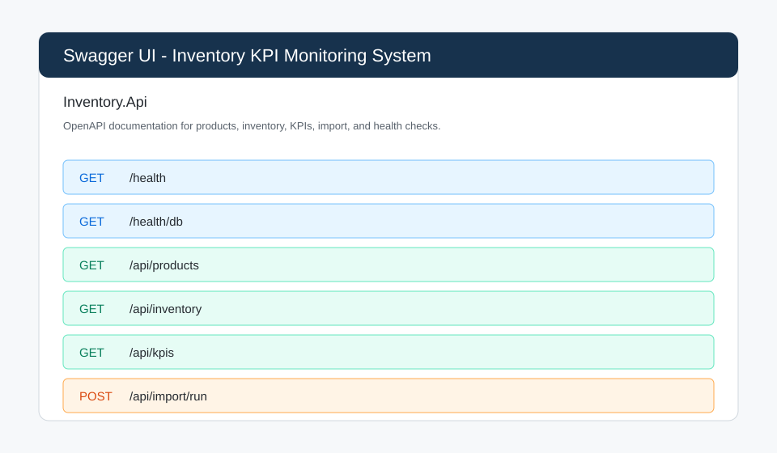
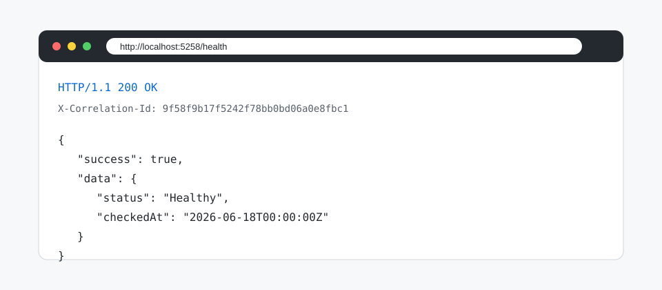
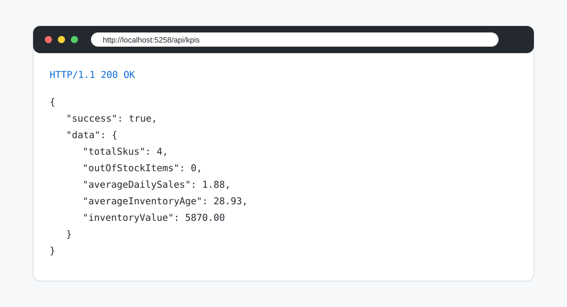
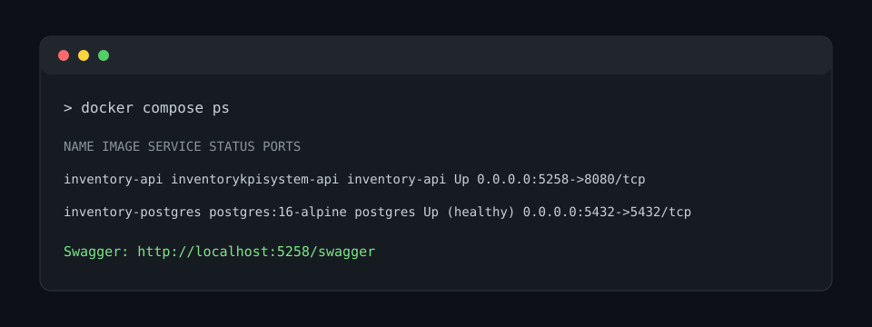

# Inventory KPI Monitoring System

[](https://github.com/supasentai/InventoryKpiSystem/actions/workflows/ci.yml)

Inventory KPI Monitoring System is a .NET 10 portfolio project for importing product and invoice files, maintaining FIFO-based inventory state, calculating inventory KPIs, and exposing the workflow through an ASP.NET Core Web API.

The project is structured with Clean Architecture so business logic stays independent from file parsing, PostgreSQL persistence, Docker setup, logging, and the HTTP API layer.

## CV-Ready Summary

Built an Inventory KPI Monitoring System with .NET 10, ASP.NET Core Minimal APIs, Clean Architecture, EF Core, PostgreSQL, Docker Compose, Swagger, Serilog, and automated tests. The system imports file-based product and invoice data, applies FIFO inventory costing, persists inventory state, exposes product/inventory/KPI endpoints, seeds demo data for reviewers, and includes CI-ready validation.

## Overview

This repository demonstrates a practical backend system rather than a sample CRUD app. It includes:

- Domain-driven inventory entities.
- FIFO stock lot consumption.
- KPI calculations for stock value, stock availability, sales activity, and inventory age.
- File-based product and invoice import.
- PostgreSQL persistence through EF Core repositories.
- ASP.NET Core API endpoints with Swagger/OpenAPI.
- Docker Compose setup for API + PostgreSQL.
- Structured logging, request logging, global exception handling, and correlation ids.
- Unit and integration tests.
- Demo seed data so reviewers can run the project quickly.

## Tech Stack

- .NET 10
- C#
- ASP.NET Core Minimal APIs
- Entity Framework Core
- PostgreSQL
- Npgsql
- Docker and Docker Compose
- Swagger/OpenAPI
- Serilog
- xUnit
- FluentAssertions
- Microsoft.AspNetCore.Mvc.Testing
- GitHub Actions

## Features

- Imports products from `InventoryKpiSystem/Data/Products`.
- Imports invoices from `InventoryKpiSystem/Data/Invoices`.
- Processes purchase invoices as stock additions.
- Processes sales invoices as stock reductions.
- Applies FIFO logic by consuming the oldest purchase lots first.
- Persists products, invoices, inventory items, stock lots, and stock movements to PostgreSQL.
- Seeds demo products, inventory items, stock lots, and stock movements when PostgreSQL is empty.
- Calculates:
  - Total SKUs with stock or sales activity.
  - Inventory value.
  - Out-of-stock item count.
  - Average daily sales.
  - Average inventory age.
- Writes JSON reports under `InventoryKpiSystem/reports`.
- Tracks processed files under `InventoryKpiSystem/processed-files`.
- Exposes API endpoints for health, products, inventory, KPIs, and import.

## Architecture

```text
Reviewer / Developer
        |
        v
Inventory.Api
  Swagger, Minimal API endpoints, logging, correlation id, ProblemDetails
        |
        v
Inventory.Application
  Import contracts, FIFO costing, KPI calculations
        |
        v
Inventory.Domain
  Product, InventoryItem, StockLot, StockMovement, Invoice, InvoiceLine
        ^
        |
Inventory.Infrastructure
  File readers, JSON storage/reporting, EF Core, PostgreSQL repositories, seed data
```

Project layout:

```text
src/
  Inventory.Domain/          Core entities, enums, and value objects
  Inventory.Application/     Interfaces, DTOs, import logic, FIFO costing, KPI services
  Inventory.Infrastructure/  File readers, JSON storage/reporting, PostgreSQL persistence, seed data
  Inventory.ConsoleApp/      Console startup, file monitoring, report menu
  Inventory.Api/             ASP.NET Core Web API endpoints and OpenAPI documentation

tests/
  Inventory.Application.Tests/  Unit and integration tests

docs/
  architecture.md               Clean Architecture overview
  api-overview.md               API usage notes
  screenshots/                  Project walkthrough screenshots
```

More documentation:

- [Architecture notes](docs/architecture.md)
- [API overview](docs/api-overview.md)

## API Endpoints

Swagger UI:

```text
http://localhost:5258/swagger
```

OpenAPI JSON:

```text
http://localhost:5258/openapi/v1.json
```

Endpoints:

| Method | Path | Description |
| --- | --- | --- |
| GET | `/health` | Checks whether the API is running. |
| GET | `/health/db` | Checks PostgreSQL connectivity. |
| GET | `/api/products` | Lists persisted products. |
| GET | `/api/inventory` | Lists inventory quantities, value, sales, and FIFO purchase lots. |
| GET | `/api/kpis` | Calculates inventory KPI values. |
| POST | `/api/import/run` | Imports file-based product and invoice data, then persists the resulting state. |

Successful API responses use:

```json
{
  "success": true,
  "data": {}
}
```

Errors use ASP.NET Core `ProblemDetails`.

Every API response includes `X-Correlation-Id`.

### API Examples

Health:

```bash
curl http://localhost:5258/health
```

Sample response:

```json
{
  "success": true,
  "data": {
    "status": "Healthy",
    "checkedAt": "2026-06-18T00:00:00Z"
  }
}
```

Products:

```bash
curl http://localhost:5258/api/products
```

Sample response:

```json
{
  "success": true,
  "data": [
    {
      "productId": "DEMO-CHAIR",
      "itemCode": "CHAIR-001",
      "name": "Ergonomic Office Chair"
    }
  ]
}
```

Inventory:

```bash
curl http://localhost:5258/api/inventory
```

Sample response:

```json
{
  "success": true,
  "data": [
    {
      "productId": "DEMO-CHAIR",
      "itemCode": "CHAIR-001",
      "name": "Ergonomic Office Chair",
      "quantityOnHand": 12,
      "totalSoldQuantity": 8,
      "totalStockValue": 1525.00,
      "purchaseBatches": [
        {
          "purchaseDate": "2026-01-05T00:00:00Z",
          "unitCost": 125.00,
          "initialQuantity": 20,
          "remainingQuantity": 7
        }
      ]
    }
  ]
}
```

KPIs:

```bash
curl http://localhost:5258/api/kpis
```

Sample response:

```json
{
  "success": true,
  "data": {
    "generatedAt": "2026-06-18T00:00:00",
    "totalSkus": 4,
    "outOfStockItems": 0,
    "averageDailySales": 1.88,
    "averageInventoryAge": 28.93,
    "inventoryValue": 5870.00,
    "topProducts": []
  }
}
```

Run import:

```bash
curl -X POST http://localhost:5258/api/import/run
```

Sample response:

```json
{
  "success": true,
  "data": {
    "message": "Import completed.",
    "productFilesProcessed": 1,
    "invoiceFilesProcessed": 2,
    "persistedToDatabase": true
  }
}
```

## Docker Setup

Run the API and PostgreSQL:

```bash
docker compose up --build
```

This starts:

- `inventory-api` at `http://localhost:5258`
- `postgres` at `localhost:5432`

On startup, the API applies EF Core migrations and inserts demo seed data only when PostgreSQL is empty. That means reviewers can open Swagger and query useful data without running manual imports first.

Stop containers:

```bash
docker compose down
```

Stop containers and remove the local PostgreSQL volume:

```bash
docker compose down -v
```

Sample reviewer flow:

1. Run Docker Compose.

   ```bash
   docker compose up --build
   ```

2. Open Swagger.

   ```text
   http://localhost:5258/swagger
   ```

3. Query seeded demo data.

   ```text
   GET http://localhost:5258/api/products
   GET http://localhost:5258/api/inventory
   GET http://localhost:5258/api/kpis
   ```

4. Optionally run import to replace demo state with file-based sample data.

   ```bash
   curl -X POST http://localhost:5258/api/import/run
   ```

5. Query the API again.

   ```text
   GET http://localhost:5258/api/products
   GET http://localhost:5258/api/inventory
   GET http://localhost:5258/api/kpis
   ```

## Database

Default connection string shape:

```json
{
  "ConnectionStrings": {
    "InventoryDb": "Host=localhost;Port=5432;Database=inventory_kpi;Username=postgres;Password=postgres"
  }
}
```

Apply migrations from the host:

```bash
dotnet ef database update --project src/Inventory.Infrastructure/Inventory.Infrastructure.csproj --startup-project src/Inventory.Api/Inventory.Api.csproj --context InventoryDbContext
```

When running migrations from the host against Docker PostgreSQL, use `Host=localhost`. Inside Docker Compose, the API uses `Host=postgres`.

## Testing

Build:

```bash
dotnet build InventoryKpiSystem.sln
```

Test:

```bash
dotnet test InventoryKpiSystem.sln
```

Tests include:

- Unit tests for application-level FIFO and KPI behavior.
- API integration tests using `Microsoft.AspNetCore.Mvc.Testing`.
- Test doubles for repositories and database health checks so integration tests do not require a live PostgreSQL instance.

CI runs on GitHub Actions for pull requests and pushes to `main`.

## Observability

The API uses Serilog for structured logging.

Logs are written to:

```text
logs/inventory-api-yyyyMMdd.log
```

The API also logs to the console for local development and Docker Compose.

Logged events include:

- Application startup and shutdown.
- HTTP method, route, status code, and duration.
- Import execution start, completion, and failures.
- PostgreSQL health check execution and result.
- Unexpected exceptions with stack traces.

Correlation id behavior:

- Incoming `X-Correlation-Id` values are reused when provided.
- A new correlation id is generated when a request does not provide one.
- The correlation id is included in logs and returned in the `X-Correlation-Id` response header.
- Unexpected error responses include `ProblemDetails.extensions.correlationId`.

## Screenshots









## Troubleshooting

Database connection issues:

- Confirm PostgreSQL is running with `docker compose ps`.
- Check `GET /health/db`.
- Use `Host=postgres` inside Docker and `Host=localhost` from the host.

Migration issues:

- Start PostgreSQL before running `dotnet ef database update`.
- Verify that the `InventoryDb` connection string points to the expected database.
- Use `docker compose down -v` only when you are okay deleting local PostgreSQL data.

Port conflicts:

- If `5258` is already in use, change the `inventory-api` port mapping in `docker-compose.yml`.
- If `5432` is already in use, change the `postgres` port mapping or stop the other PostgreSQL instance.

Logging and correlation issues:

- Check console output first when running with `dotnet run` or Docker Compose.
- Check rolling log files under `logs/`.
- Use the `X-Correlation-Id` response header to find logs for a specific request.

## Run Without Docker

Run the API:

```bash
dotnet run --project src/Inventory.Api/Inventory.Api.csproj
```

Run the console app:

```bash
dotnet run --project src/Inventory.ConsoleApp/Inventory.ConsoleApp.csproj
```

The API and console app use the sample/runtime data under `InventoryKpiSystem/`.

## Future Improvements

- Add pagination and filtering for larger product and inventory datasets.
- Add richer import result reporting.
- Add more database-backed integration tests.
- Add deployment documentation for a managed cloud environment.
- Add performance benchmarks for large invoice batches.

## Current Validation

- `dotnet build InventoryKpiSystem.sln`
- `dotnet test InventoryKpiSystem.sln`
- GitHub Actions CI
